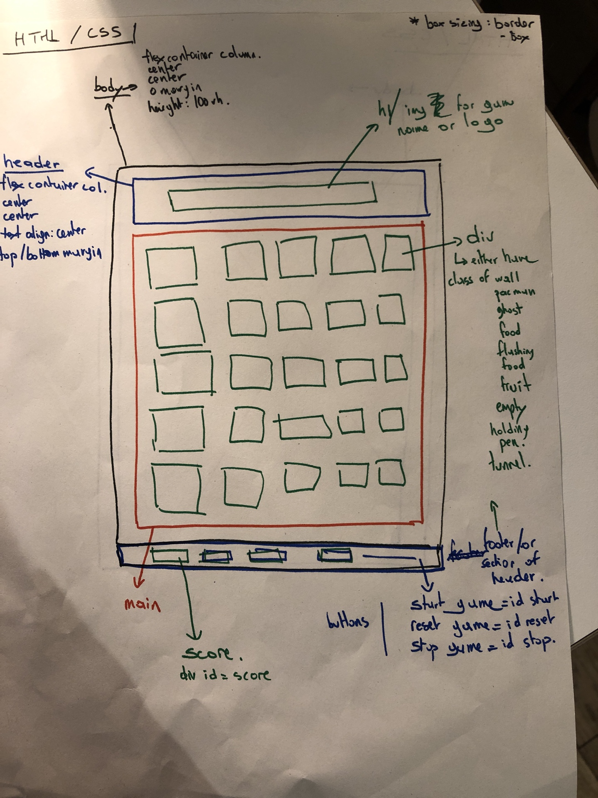

# Project 1: Pac Man Planning
#SEI/projects/project1

## Challenges
### Set up the grid and where each things are
Used a event listener to get the array I dev tools and copied it

## Plan
### Friday
- [ ] Build the grid
- [ ] Get images:
	- [x] logo
	- [x] characters: MJ, Werewolf,  Zombies, Zombies in ground, eyes
	- [x] icons: full moon, tombs, mud
- [ ] Try and make the characters move

### Saturday
- [ ] Sounds

### Sunday

### Monday

### Tuesday

### Wednesday

### Thursday

### Friday

## Specs

### Creating the grid
_array_ of cells (array of wallsm pellets etc, )
For each inside the for loop
Fix or dynamic grid
Set the grid
Define what is a wall, what has pallets, what has dots, what is the holding pen

- - - -
### Playing the game

#### Start Button when clicked start the game
- [ ] Set an id on the button
- [ ] Grab the button
- [ ] Create a click event listener which will run
	- [ ] function that starts the game, this function will contain whole code blocks from the game

#### Game Function

##### Characters appear in their starting position but don’t move and “Ready? Message” appear
- [ ] Character Starting positions
- [ ] [ ] create an _array_ of  _objects_ for characters (ghost x 4, Pac Man each object has a name (string) and starting position (number), type (ghost, Pac Man, power pellet (boolean set on false by default)
- [ ] [ ] create _const_ to grab the characters and _starting_ positions
- [ ] [ ] For Each Loop where each element of the Array of characters:
- [ ] [ ] select the starting cell on the grab using the start position in the array of object of each character
- [ ] [ ] add to this cell the class of each character by grabbing the name within the array of object (name in the object is matching the class name)

- [ ] Ready Message
	- [ ] _const_ Select the targeted cell to display the message by its id
	- [ ]  create element ‘p’
	- [ ] inner HTML ‘Ready?’’
	- [ ] append to the cell selected

**Further Development**
- [ ] [ ] ::TBC How in the case of dynamic grid types (ie if I choose to build 18x18, then 20x20 or rectangle etc::
- [ ] [ ] ::TBC How to do display message if dynamic grid we want to generate different grids::

##### Characters move
- [ ] `setTimeout` that will run after 3 sec
	- [ ] remove class of each character in their starting position cell
	- [ ] For each character over the character array
		- [ ] `SetInterval` run every x seconds
			- [ ] if property of the character in object is ‘ghost’
				- [ ] start moving them randomly
					- [ ] grab a random cell using math random of the _array_ cell (**function grab a random cell**)
					- [ ] give this cell the class of the ghost
					- [ ] ::conditions of movement::
						- [ ] **function**cell should bot be a wall
						- [ ] **function pellet encounter** if the cell is Pac Man and if property of Pac Man power pellet is false, then eat Pac Man (class of pacman removed and class of the ghost added), _ _remove 1 life + reset to original position but leave points__
						- [ ] **function pellet encounter** if the cell is Pac Man and if its pellet property is true in the character object then ghost gets eaten (remove class of ghost, add class of pacman, add class of ghost to its starting position) + add 200 points to _let_ points
						- [ ] **function** if the cell is entrance of tunnel go to the opposite side
			- [ ] else (if property of objectPac Man)
				- [ ] event listener (keyup)
				- [ ] movement code block
				- [ ] conditions if
					- [ ] **function** cell not a wall
					- [ ] **function pellet encounter**
					- [ ] if cell has class of power pellet, remove it, replace by class of Pac Man, add 50pts, change pellet value of pac man object to true and also to the ghost property so they change colour/start flashing
					- [ ] **function** if tunnel go to opposite side
					- [ ] if cell has class of dot, remove it, replace by class of Pac Man, add 10 points to points variable, make sure it is replaced by empty
					- [ ] if cell has class of fruit, remove it, replace it by Pac Man, add 100 points
##### Generate fruits when x amount of points are reached
- [ ] If points >= xx
- [ ] Set Interval = 15s (to be decided)
	- [ ] remove class of fruits from selected cell
	- [ ] clear interval
	- [ ] grab a random cell using math random (**function grab a random cell**)
	- [ ] give it class of fruits
	- [ ] if eaten (cell become class of Pac Man, then clear interval)
##### Power Pellet mode
- [ ] Interval 15s
- [ ] Start when class of pellet in a cell is replaced by Pac Man
- [ ] Pacman and ghost take value of true on their pellet object
- [ ] Ghost flash or change colour
- [ ] **function** pellet encounter

##### Game Over
If _let_ life = 0
Clear Interval
Go back to starting position
Life = 3
Points = 0
Ready for a new start button click to start again
Alert you have lost all your lifes etc
Possible to hide the whole grid (display none with score)

##### Game finished
When no classes of dot or pellet . Use a any array function
If false then game is finished
Clear Interval
Alert final score

## Enhancement ideas
* Make the grid appear when the game starts
* Play intro music when the game starts and the characters appear
* Game start display a message
* Each ghost
* Pop up showing points when eating a ghost
* Multiple fruits with higher points
* Pausing the game / Resuming the game
* Reseting the game
* Stopping the game
* Manage collision between zombies
* Zombies not starting at the same time
* Cumulative points when eating zombies and when they return the holding pen, reset the number of zombies to 4
* Increase speed of MJ during full moon mode
