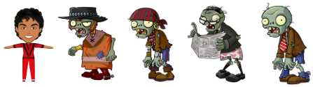

# <p><span>Pac-Man Thriller Edition</span></p>
<hr/>
<br/><br/><br/>

<p align="center"></p>

<!---->

<br/>
## Table of Contents
* [Overview](#overview)
* [Play the game](#play)
* [Project Brief](#brief)
* [Technologies Used](#technologies)
* [Approach](#approach)
* [Final Product](#final)
* [Future Enhancements](#enhancements)
* [Wins & Challenges](#wins-and-challenges)


<br/>
## <a name="overview"></a>Overview
This was my first project from the Software Engineering Immersive Course I took at General Assembly London, built after 4 weeks of class. This was also my first ever project as a developer. 

It was a **solo project** and the timeframe was **one week**.

I have created a grid based version of the classic game [Pac-Man](https://en.wikipedia.org/wiki/Pac-Man) using **HTML**, **CSS**, **Vanilla JavaScript** and **DOM Manipulation**. 

The theme of the game is inspired after Michael Jackson’s Thriller [video clip](https://www.youtube.com/watch?v=4V90AmXnguw). **Pac-Man** has been replaced by **Michael** and the traditional **ghosts** by **zombies**. **Power Pellets** are **Full Moons** and the **Bonus Fruit** has been replaced by **Pop Corn**.

>Access the **game** [here](https://fdepasse.github.io/pacman-thriller/) and the **repository** [here](https://github.com/fdepasse/pacman-thriller)


<br/>
## <a name="play"></a>Play the game
* Visit this [link](https://fdepasse.github.io/pacman-thriller/)
* Click the **Start Game** button to launch the game
* Once all characters have appeared start moving Michael using the **top**, **right**, **down** and **left** arrow keys of your keyboard
* Eat all dots and full moons to **win the game** while avoiding being caught by the zombies
* When Michael lands on a **Full Moon** he will turn into a Werewolf for 10 seconds and will have the ability to eat zombies and score extra points
* After reaching the 400 and 800 points markers a **Pop Corn** bonus worth 100 points will appear at a random location on the grid
* You will **lose the game** if you lose your 3 lives
* You can **reset** the game at any point by clicking the **Reset Game** button
* Points system: **Dots** 10 points, **Moons** 50 points, **Pop Corn** 100 points, **Zombie** (during Full Moon Mode) points


> In pure classic Pac-Man style, once you have initiated the first movement, Michael will automatically carry on moving in the same direction until you press another arrow key or he encounters a grave stone or a zombie

<br/>
## <a name="brief"></a>Project Brief
* Render a game in the browser
* Design logic for winning & visually display which player won
* Include separate HTML / CSS / JavaScript files
* Stick with KISS (Keep It Simple Stupid) and DRY (Don’t Repeat Yourself) principles
* Use Javascript for DOM manipulation
* Deploy your game online, where the rest of the world can access it
* Use semantic markup for HTML and CSS (adhere to best practices)

<br/>
## <a name="technologies"></a>Technologies Used

###Frontend
* HTML
* CSS
* Vanilla JavaScript
* Google Fonts

###Development tools
* VS Code
* Git
* GitHub (including deployment)
* Google Chrome Dev Tools
* QuickTime Player (sound editing)
* Preview (pictures editing)
* Zoom
* Slack

<br/>
## <a name="approach"></a>Approach
### Step 1: Building the board
<p align="center"></p>

#### Problem #1: Programatically generate a 18 x 18 square grid via DOM Manipulation
I used a **for loop** to create all the cells. I gave each of them an innerHTML (useful for debugging), an id (extensively used during the course of the game for the characters’ positions) and dimensions. I also pushed all cells to an array for future use.

```
for (let i = 0; i < gridWidth ** 2; i++) {
  const newCell = document.createElement(‘div’)
  grid.appendChild(newCell)
  newCell.innerHTML = i
  newCell.id = i
  newCell.style.width = `${100 / gridWidth}%`
  newCell.style.height = `${100 / gridWidth}%`
  allCells.push(newCell)
}
```

#### Problem #2: Give each cell the right class to represent "stones", "dots", "moons" and "tunnels"
I chose to store my cells by type within an object of arrays, each key being a cell type taking an array of cells as value as per below.

``` 
const cellsObject = {
stones: [0, 1, 2, 3, 4, 5, 6, 7, 8, 9, 10, 11, 12, 13, 14, 15, 16, 17, 18, 36, 54, 72, 90, 108, 126, 162, 180, 198, 216, 234, 252, 270, 288, 306, 307, 308, 309, 310, 311, 312, 313, 314, 315, 316, 317, 318, 319, 320, 321, 322, 323, 305, 287, 269, 251, 233, 215, 197, 179, 143, 125, 107, 89, 71, 53, 35, 26, 44, 62, 63, 45, 27, 47, 48, 49, 50, 51, 69, 68, 67, 66, 65, 60, 59, 58, 57, 56, 38, 39, 40, 41, 42, 92, 93, 94, 95, 96, 97, 98, 99, 100, 101, 102, 103, 104, 105, 114, 132, 134, 135, 153, 152, 137, 119, 139, 140, 141, 142, 127, 128, 129, 130, 168, 186, 187, 188, 189, 190, 191, 173, 175, 193, 194, 176, 177, 195, 196, 178, 163, 181, 164, 182, 165, 183, 166, 184, 206, 207, 225, 224, 222, 220, 219, 218, 236, 237, 238, 240, 258, 259, 260, 261, 262, 263, 245, 227, 229, 247, 248, 230, 231, 249, 272, 273, 274, 275, 276, 277, 278, 279, 280, 281, 282, 283, 284, 285],
  dots: [291, 292, 290, 289, 293, 294, 294, 295, 296, 297, 298, 299, 300, 301, 302, 303, 304, 268, 267, 266, 265, 264, 257, 256, 254, 255, 253, 235, 217, 199, 200, 201, 202, 203, 221, 239, 204, 205, 223, 226, 208, 209, 210, 228, 246, 211, 212, 213, 214, 232, 250, 185, 185, 167, 145, 146, 147, 148, 149, 131, 113, 112, 111, 109, 110, 91, 73, 55, 19, 20, 21, 22, 23, 24, 25, 43, 61, 74, 75, 76, 77, 78, 79, 80, 81, 82, 64, 46, 28, 29, 30, 31, 32, 33, 34, 70, 83, 84, 85, 86, 87, 88, 106, 124, 123, 122, 121, 120, 138, 156, 174, 192, 157, 158, 159, 160],
  moons: [37, 52, 271, 286],
  tunnelright: 161,
  tunnelleft: 144
}
```
I then created a function to loop through each array in `cellsObject` and give each cell the relevant class on the board.

```
function giveClassToCells(array, className) {
  array.forEach((element) => {
    selectCellId(element).classList.add(className)
  })
}
giveClassToCells(cellsObject.stones, 'stone')
```

<br/>
<hr/>
### Step 2: Creating the characters
<p align="center"></p>

#### <a name="position"></a>Problem #1: Store information about the characters so it can be easily accessed to manipulate the DOM
I created a class of `Character` taking the following properties common to all characters: `charName` (a CSS class of the character), `startPosition` (a cell id number to know where to make the characters appear on the grid at first) and `position` (the cell id position where the character currently is at any point during the game).

```
class Character {
  constructor(charName, startPosition) {
    this.charName = charName
    this.startPosition = startPosition
    this.position = ''
  }
}
```

#### Problem #2: Capture each character specificities
For Michael, I needed an extra key-value pair to be able to change Michael's status between "Normal" and "Werewolf" depending if the Full Moon mode was activated or not. I have created an extension of the Character class to a class of Hero so I could add the status of Michael (mj = normal mode / mj-werewolf = full moon mode).

```
class Hero extends Character {
  constructor(charName, startPosition) {
    super(charName, startPosition)
    this.status = 'mj'
  }
}
```
For the zombies, I have stored the 4 objects in an array so I could manage their behaviour all at once by [looping through them](#zombies). 


<br/>
<hr/>
### Step 3: The Game Flow
#### Problem #1: Keeping track of the lives, the points scored and the Full Moon mode
As these variables change during the game, they trigger specific events. Therefore, it was important to be able to check their status at all time. For this reason, I have stored them in global variables:

* `lives` set to 3 by default and decreases when Michael gets caught by zombies
* `points` set to 0 to start with and updates as the player eats dots, moons, pop corn and zombies when in Full Moon mode
* `fullMoon` set to false by default and switches to true when Michael lands on a moon

<p align="center"></p>

#### Problem #2: Make Michael move with the arrow keys of the keyboard, manage his behaviour and his impact on the game depending on the situation he encounters
Michael’s movements have been wrapped under a function called `michaelMoves()`. It listens to "keyup" events on the keyboard and returns the relevant set of behaviours depending on whether the key pressed is "up", "right", "down" or "left" (managed with an if statement). 

When a key is pressed:

* An interval running the code every 300ms allows Michael to move on its own once a direction key has been pressed
* If statements constantly check `michael.position` (property of `michael` [object](#position)) and his next move
* Depending on the type of cell he is landing on, the relevant logic is applied
* Points scoring is captured in this statement

```
function michaelMoves() {

  document.addEventListener('keyup', (event) => {
    const keyPressed = event.key

    if (keyPressed === 'ArrowRight') {
      clearInterval(michaelInterval)
      michaelInterval = setInterval(() => {
        removeMichael()
        if (michael.position === cellsObject.tunnelright) {
          michael.position = cellsObject.tunnelleft
          selectCellId(cellsObject.tunnelleft).classList.add(michael.status)
        } else if (selectCellId(michael.position + 1).classList.contains('stone')) {
          selectCellId(michael.position).classList.add(michael.status)
        } else if (selectCellId(michael.position + 1).classList.contains('dot')) {
          michael.position++
          selectCellId(michael.position).classList.add(michael.status)
          selectCellId(michael.position).classList.remove('dot')
          points += 10
          displayScore.innerHTML = points
        } else if (selectCellId(michael.position + 1).classList.contains('moon')) {
          michael.position++
          selectCellId(michael.position).classList.add(michael.status)
          selectCellId(michael.position).classList.remove('moon')
          points += 50
          displayScore.innerHTML = points
          if (fullMoon === false) {
            fullMoon = true
            removeMichael()
            michael.status = 'mj-werewolf'
            selectCellId(michael.position).classList.add(michael.status)
            logo.setAttribute('src', 'images/full-moon.png')
            logo.setAttribute('alt', 'Full Moon')
            logo.style.width = '20%'
            logo.style.padding = '0 0 7.5% 0'
            setTimeout(() => {
              removeMichael()
              fullMoon = false
              michael.status = 'mj'
              selectCellId(michael.position).classList.add(michael.status)
              logo.setAttribute('src', 'images/thriller-logo.png')
              logo.setAttribute('alt', 'Thriller Logo')
              logo.style.width = '50%'
            }, 10000)
          }
        } else if (selectCellId(michael.position + 1).classList.contains('pop-corn')) {
          michael.position++
          selectCellId(michael.position).classList.add(michael.status)
          selectCellId(michael.position).classList.remove('pop-corn')
          points += 100
          displayScore.innerHTML = points
        } else {
          michael.position++
          selectCellId(michael.position).classList.add(michael.status)
        }
      }, 300)
    }
...
```

#### <a name="zombies"></a>Problem #3: Make the Zombies move randomly on the grid, manage their behaviour and their impact on the game depending on the situation they encounter
* To manage the zombies behaviour, I have set a number of if statements within a for loop over the array of zombies I created (containing each zombie as an object).
* The for each loop is nested within an  interval to allow each zombie to move automatically every 300 ms as well as checking what cell they are landing to adapt they behaviour accordingly
* If statements are in place to adapt the zombie’s behaviour when encountering Michael, a stone, a tunnel or any other cell
* When encountering Michael, the zombie’s behaviour is different whether the full moon mode is activated or not.  I have therefore split the for each loop into 2 main if statements: when the full moon mode is on and when it is not

```
// Storing all possible directions for the Zombies
  const zombieDirectionArray = [1, -1, gridWidth, -gridWidth]

  // Timeout to start the game after a couple of seconds
  setTimeout(() => {

    const gameInterval = setInterval(() => {
      // Check is there are still any dots or moon on the board
      // If not game is won
      gameWon(gameInterval)
      // Run the below for each zombie in the array of objects 'zombies'
      zombies.forEach((zombie) => {
        // Create a const to store the next move
        const randomDirection = zombieDirectionArray[Math.floor(Math.random() * zombieDirectionArray.length)]
        // Remove the zombie class at the start of each loop
        selectCellId(zombie.position).classList.remove(zombie.charName, 'zombie', 'zombie-scared')
        // What happens in normal mode
        if (fullMoon === false) {
          // What happens if Zombies encounter Michael
          if (zombie.position === michael.position) {
            clearInterval(gameInterval)
            removeMichael()
            selectCellId(zombie.position).classList.add(zombie.charName, 'zombie')
            if (lives > 0) {
              lives--
              displayLives[lives].setAttribute('src', 'images/lives-lost.png')
              setTimeout(() => {
                removeAllZombies()
              }, 1000)
              setTimeout(() => {
                allCells.forEach((cell) => {
                  cell.classList.remove(michael.status)
                })
                michaelToStartPosition()
                zombiesToStartPosition()
              }, 1000)
              playGame()
            } else {
              gameOver()
            }
            //  How the Zombie navigate the grid (move randomly avoiding stones, going through tunnel etc)
          } else if (zombie.position === cellsObject.tunnelright) {
            if (randomDirection === 1) {
              zombie.position = cellsObject.tunnelleft
              selectCellId(cellsObject.tunnelleft).classList.add(zombie.charName, 'zombie')
            } else {
              zombie.position--
              selectCellId(zombie.position).classList.add(zombie.charName, 'zombie')
            }
          } else if (zombie.position === cellsObject.tunnelleft) {
            if (randomDirection === -1) {
              zombie.position = cellsObject.tunnelright
              selectCellId(cellsObject.tunnelright).classList.add(zombie.charName, 'zombie')
            } else {
              zombie.position++
              selectCellId(zombie.position).classList.add(zombie.charName, 'zombie')
            }
          } else if (selectCellId(zombie.position + randomDirection).classList.contains('stone')) {
            selectCellId(zombie.position).classList.add(zombie.charName, 'zombie')
          } else {
            zombie.position += randomDirection
            selectCellId(zombie.position).classList.add(zombie.charName, 'zombie')
          }
...
```


### Generic start game
* The game starts when the “Start Game” button is clicked by calling the `playGame()` within and even listener
* The `playGame()`  function is called 3 seconds after the button is clicked leaving time for the intro music to play and for the grid and characters to appear, all being managed with timeouts
* On click of the button, Michael can start moving as well
* The function `michaelMoves()` manages Michael’s behaviour and the `playGame()` function controls the flow of the game and includes the interval within which we are looping through the Zombie array to control their behaviour at different stage of the game

```
document.querySelector('#start').addEventListener('click', () => {
  audioPlayer.src = 'sounds/intro.m4a'
  audioPlayer.play()
  setTimeout(() => {
    giveClassToCells(cellsObject.dots, 'dot')
    giveClassToCells(cellsObject.moons, 'moon')
  }, 2300)
  setTimeout(() => {
    zombiesToStartPosition()
    michaelToStartPosition()
    michaelMoves()
    playGame()
  }, 3000)
})
```


### Full Moon Mode
* The mode is started for 10 seconds when Michael lands on a cell with the class of “moon”, only if a “Full Moon” mode is not already active
* When the above happens, Michael scores 50 points, the Thriller logo is replaced by the full moon, Michael tuns into a werewolf
* After 10 seconds, a Timeout ensures that the full moon mode is switched off, Michael returns to its normal form and the Thriller logo comes back
* This code is included in the function called `michaelMoves()` 

``` javascript
...
else if (selectCellId(michael.position + 1).classList.contains('moon')) {
          michael.position++
          selectCellId(michael.position).classList.add(michael.status)
          selectCellId(michael.position).classList.remove('moon')
          points += 50
          displayScore.innerHTML = points
          if (fullMoon === false) {
            fullMoon = true
            removeMichael()
            michael.status = 'mj-werewolf'
            selectCellId(michael.position).classList.add(michael.status)
            logo.setAttribute('src', 'images/full-moon.png')
            logo.setAttribute('alt', 'Full Moon')
            logo.style.width = '20%'
            logo.style.padding = '0 0 7.5% 0'
            setTimeout(() => {
              removeMichael()
              fullMoon = false
              michael.status = 'mj'
              selectCellId(michael.position).classList.add(michael.status)
              logo.setAttribute('src', 'images/thriller-logo.png')
              logo.setAttribute('alt', 'Thriller Logo')
              logo.style.width = '50%'
            }, 10000)
          }
...
```

* During the “Full Moon” mode, Michael as a werewolf can eat the Zombies and score 200 points in the process. 
* Zombies become scared and take a class of “zombie-scared” which makes them shake
* Once eaten, Zombies are sent back to their starting position
* This part of the program has been included within the for each loop over the  Zombie so that each a potential encounter with Michael can be checked over the 4 characters.
``` javascript
if (fullMoon === true) {
          //  What happens if Zombies encounter Michael Werewolf
          if (zombie.position === michael.position) {
            selectCellId(zombie.position).classList.remove(zombie.charName, 'zombie-scared')
            zombie.position = zombie.startPosition
            points += 200
            displayScore.innerHTML = points
            setTimeout(() => {
              selectCellId(zombie.position).classList.add(zombie.charName, 'zombie-scared')
            }, 5000)
```


### Pop Corn Time
* Once 400 and 800 points have been reached a “Pop - Corn” bonus appear randomly on the board. If eaten by Michael it gives an extra 100 points to the player.
* A  `popCornRandomLocation()` is there to generate random position for the pop corn to appear. It is called within a `popCornMode()` function which is to give the random location a class of pop corn (making the pop corn appear on the grid at the random location) and 10 seconds later removing this class to make the pop corn disappear with a timeout. 
``` javascript
function popCornMode() {
  if (popCornTime === 1) {
    popCornRandomLocation()
    selectCellId(popCornPosition).classList.add('pop-corn')
    return setTimeout(() => {
      selectCellId(popCornPosition).classList.remove('pop-corn')
      popCornTime = 0
    }, 10000)
  }
}
```
* The  `popCornMode()`  function is called within and if statement in the the Zombie interval to check every 300ms whether 400 or 800 points have been reached. 
* popCornTime is a global variable equal to 0 when pop corn mode is off and reassigned to 1 when it is on
``` javascript
if (points === 400 || points === 800) {
        popCornTime++
        popCornMode()
      }
```


### Variables & Functions
* A number of variables and functions have been globally declared to track the progress of the game


* `gameWon()` function is called at the start of the `playGame()` function to check whether all dots and moons have been eaten by the player and if so triggers the winning screen to appear and the winning music to play
* `gameOver()` function is called within the the for each loop in the zombie interval when a zombie eats Michael and there are no lives left. It then triggers losing screen and music.

* `popCornPosition` is assigned a random position in the `popCornPossibleLocations()` function when the Pop Corn mode is triggered
* `popCornTime` is assigned to 0 to start with and gets updated to 1 once 400 points or 800 points are reached 


<br/>
## <a name="final"></a>Final Product

<br/>
## <a name="enhancements"></a>Enhancements
### Remaining Bugs
* The collision detection within Michael and the Zombies is not perfect depending on when the characters started their interval.
* Although all three lives have been lost, the player can still have a last go and only loses the game after losing 4 lives

<br/>
## Potential Future Enhancements
* Smart zombies that will track Michael using path finding algorithm
* Different behaviour for each Zombie
* Not allowing collision between zombies
* Zombies not starting at the same time
* Scoreboard using local storage
* Responsiveness, multiple browsers and mobile compatibility
* Multiple grids and levels
* Multiple bonus items in addition to pop corn
* Display a message when the starts
* Adding an instruction section to explaining how to play the game and rules
* Pop up showing points when eating a ghost
* Pausing the game / Resuming the game
* Cumulative points when eating zombies

<br/>
## <a name="wins-and-challenges"></a>Wins & Challenges
* Setting up a grid game in a programatic way with minimal HTML and CSS involvement 
* Code duplication: as my first project the code written is not the most optimised and would need to be re looked at
* Understanding timings with TimeOuts and Intervals has definitely been a challenge and how to deal with them once they are nested with each other (.i.e. collision detection)
