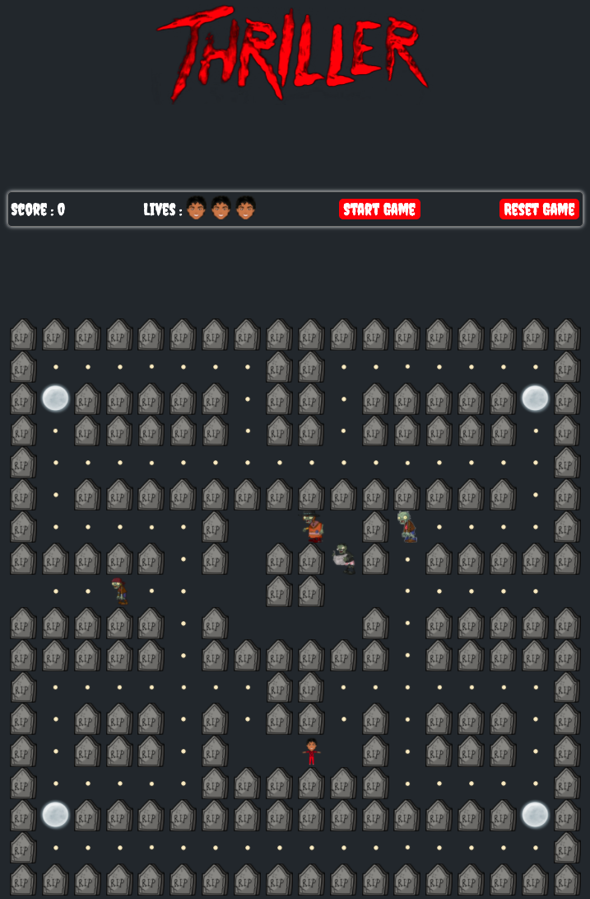

#  Pac - Man Thriller Edition
#SEI/projects/project1

## Overview
This was the first project from the Software Engineering Immersive Course at General Assembly London, built after 4 weeks of class. This was also my first ever project as a developer. 

All students have been given the task to individually create a grid based game using HTML, CSS and JavaScript within one week. We had the choice of several games and I picked Pac - Man. 

To make my game a bit different, I have inspired it after Michael Jackson’s Thriller soundtrack and video clip. **Pac - Man** has been replaced by **Michael** and the traditional **ghosts** by **zombies**. **Power Pellets** are **Full Moons** and the **Bonus Fruit** appearing after a certain amount of dots is gathered has been replaced by **Pop Corn**.

## Brief
* **Render a game in the browser**
* **Design logic for winning** & **visually display which player won**
* **Include separate HTML / CSS / JavaScript files**
* Stick with **KISS (Keep It Simple Stupid)** and **DRY (Don’t Repeat Yourself)** principles
* Use **Javascript** for **DOM manipulation**
* **Deploy your game online**, where the rest of the world can access it
* Use **semantic markup** for HTML and CSS (adhere to best practices)

## Technologies Used
* HTML
* CSS
* JavaScript
* QuickTime Player
* Preview
* Git and GitHub
* Google Fonts

## Approach

### Remaining Bugs

## Potential Future Enhancements
* Server-side saved scoreboard
* Mobile-compatibility
* Different behaviour for each ‘ghost’, more complexity
* Further levels
* * Game start display a message
* Pop up showing points when eating a ghost
* Multiple fruits with higher points
* Pausing the game / Resuming the game
* Stopping the game
* Manage collision between zombies
* Zombies not starting at the same time
* Cumulative points when eating zombies and when they return the holding pen, reset the number of zombies to 4
* Increase speed of MJ during full moon mode

## Challenges & Lessons learned
* Set up the grid: Used a event listener to get the array I dev tools and copied it

## Credits
